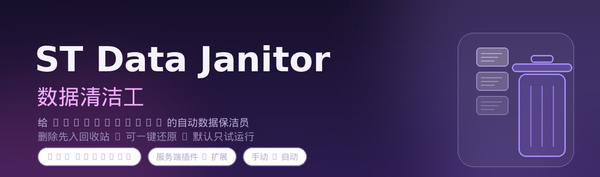

# ST Data Janitor · 数据清洁工

> 给 **SillyTavern** 的「数据保洁员」：自动 / 手动清理 `data` 目录里的**无用数据**与**多余数据**。
> 所有删除**先入回收站**、可一键还原；默认只「试运行」，不点头不动手。

[](LICENSE)
[](https://github.com/SillyTavern/SillyTavern)
[](CHANGELOG.md)
[](#-安装)

---

## ⚠️ 动手之前，请先读完这一节

### 数据无价

你的**角色卡、聊天记录、世界书、预设、主题、人设**……是几个月甚至几年的心血。
它们不像代码可以重写，**删掉就是删掉了**。

本工具确实能帮你清出几个 GB 的空间，但请永远记住：

> **清理 ≠ 备份。任何自动清理工具都不能代替你自己的备份。**

所以，请务必做到：

1. **先备份，再清理。**
   动手前把整个 `data` 目录完整复制一份到**另一块硬盘 / 网盘 / NAS**，或者打包留存：
   ```bash
   # 示例：打包一份带日期的完整备份（放在 data 之外的盘/目录）
   tar czf ~/st-data-backup-$(date +%Y%m%d-%H%M%S).tar.gz -C /path/to/SillyTavern data
   ```
2. **第一次用，只「扫描」和「试运行」。**
   先看看它到底打算删什么、删多少，确认规则符合你的预期。
3. **要开自动清理，先勾「自动只报告不真删」**，观察几天，再放开真删。
4. **定期看一眼回收站**，别让它默默堆着；该清空时再清空。

万一出事，最可靠的恢复手段永远是**你自己的那份备份**。本工具只能帮你「少犯错」，
不能替你「兜底」——这句话，作者是认真的。

---

## ✨ 特性

- 🧹 **7 条清理规则**，每条可独立开关：同步冲突副本 / 同步临时残留 / 系统垃圾文件 / 空目录 / 过量旧备份 / 孤儿缩略图 / 空文件。
- 🕹️ **手动 / 自动**：想清就点；也能设「每 N 分钟 / 小时 / 天」自动跑。
- 🧪 **默认试运行**：不开真删就只出报告，先看后删。
- ♻️ **删除进回收站**：同盘 `rename` 秒级完成，带清单文件，可**一键还原**；回收站还能定期自动清空。
- 🛡️ **硬保护**：`_storage/`（账号库）、`cookie-secret.txt`、`.gitkeep`、`node_modules/`、`.git/` 永不触碰。
- 📦 **旧备份按聊天分组**：保留「每个聊天最新 N 份」，不会因为某个聊天刷得勤就把别的聊天的备份挤光。
- 🔌 **零第三方运行时依赖**：服务端插件只用 Node 内置模块（外加 SillyTavern 自带的 express）。
- 🇨🇳 **中文面板**：设置页里点点点就能用，命令行也能跑。

---

## 🧩 规则详解

| 规则 | 命中的是什么 | 默认 | 可调参数 |
| --- | --- | --- | --- |
| **同步冲突副本** | 文件名形如 `xxx (conflict_on_2026-09-23)`、`xxx (conflict #1_on_2026-09-23)` 的副本——多设备/云同步打架时留下的 | ✅ 开 | `保留最新 N 份`（0 = 全清，默认 0） |
| **同步临时残留** | `.unison.*.unison.tmp` 之类的同步中间文件 | ✅ 开 | — |
| **系统垃圾文件** | `.DS_Store`、`Thumbs.db`、`desktop.ini`、`*.swp`、`*.orig`、`*~`、`.#*`、`#*#` 等 | ✅ 开 | — |
| **空目录** | 完全没有内容的目录（0 字节，多半是残留空壳） | ⬜ 关 | — |
| **过量旧备份** | `data/<用户>/backups/` 里超量的旧备份，**按聊天分组**只留最新 N 份 | ⬜ 关 | `保留最新 N 份`（默认 10） |
| **孤儿缩略图** | `thumbnails/` 里找不到对应角色卡的图片 | ⬜ 关 | — |
| **空文件** | 0 字节、且已存在超过 N 小时的文件 | ⬜ 关 | `存续 N 小时`（默认 24） |

> 默认关闭的规则都是**有一定判断风险**或**后果较重**的，请确认后再开。

---

## 🛡️ 安全设计

### 1）删除 = 进回收站，不是硬删

所有被清理的文件都会被 `rename` 到：

```
<SillyTavern>/.janitor-trash/<批次时间戳>/files/<原始相对路径>
<SillyTavern>/.janitor-trash/<批次时间戳>/manifest.json
```

- `manifest.json` 记录了这一批都动了哪些文件、原本在哪、多大。
- 面板里点「还原」即可把某一批**原样放回**（目标已存在则跳过，不覆盖）。
- 点「清空回收站」才是**永久删除**。
- `trashKeepDays`（默认 7 天）到期的旧批次会在下次清理时自动清空。

### 2）回收站刻意放在 **`data` 的同级目录**

这不是随便定的：如果你在用「酒馆云同步」之类的工具同步整个 `data` 目录，
把回收站放进 `data/` 会让被删的文件**被同步到对面去**（等于白删，甚至「复活」）。
放在同级就天然隔离，双机用户请务必保持这个位置。

### 3）硬保护名单（无论如何都不会动）

- `_storage/` —— 账号数据库，动了会登录异常
- `cookie-secret.txt` —— 各实例的会话密钥
- `.gitkeep`、`node_modules/`、`.git/`、回收站自身

### 4）默认只试运行

`autoCleanDryRun` 默认 `true`：即使开了自动模式，也只生成报告不真删。
等你确认规则合适了，再手动取消这个勾。

---

## 📦 安装

### 前置条件

- SillyTavern **1.12+**（推荐 1.18 / 1.19），且 `config.yaml` 里开了服务端插件：
  ```yaml
  enableServerPlugins: true
  ```
- 说明：本插件由「**服务端插件** + **前端扩展**」两部分组成，缺一不可。

### 方式一：安装脚本（推荐）

```bash
git clone https://github.com/wyndam-c/st-data-janitor.git
cd st-data-janitor
sudo ./install.sh /path/to/SillyTavern            # 第二个参数=用户名，默认 default-user
```

### 方式二：手动复制

```bash
# 服务端插件
mkdir -p /path/to/SillyTavern/plugins/st-data-janitor/lib
cp plugin/index.mjs        /path/to/SillyTavern/plugins/st-data-janitor/
cp plugin/lib/janitor.mjs  /path/to/SillyTavern/plugins/st-data-janitor/lib/

# 前端扩展
mkdir -p /path/to/SillyTavern/data/default-user/extensions/st-data-janitor
cp extension/* /path/to/SillyTavern/data/default-user/extensions/st-data-janitor/
```

### 最后一步：重启 SillyTavern

服务端插件**只在启动时加载**，装完必须重启一次酒馆，扩展面板里才会出现「数据清洁工」。

---

## 🖥️ 使用

### 面板操作（推荐）

重启后打开酒馆 → 右侧「扩展」面板 → 找到 **数据清洁工 (Data Janitor)**：

- **扫描**：只统计，不动手
- **试运行清理**：列出「如果清理会动哪些文件」
- **立即清理**：真的清（会先弹确认；文件进回收站）
- **清空回收站**：彻底删除（不可还原）
- **保存配置**：把规则开关 / 模式 / 间隔写进配置

### 手动 / 自动

- **手动**（默认）：你想清才清。
- **自动**：选「自动」并设置**间隔**（数值 + 单位：分钟 / 小时 / 天），到点自动跑。
  - 建议同时勾上「**自动只报告不真删**」，先观察，再放开。
  - 每次自动运行的结果会显示在面板状态栏与「最近报告」里。

### 命令行（不装到酒馆也能跑）

核心逻辑是独立的，可以直接命令行调用，适合写进 crontab 或临时救急：

```bash
# 只看不动（默认规则：冲突副本 + 同步临时残留 + 系统垃圾）
node plugin/lib/janitor.mjs --scan  /path/to/SillyTavern/data

# 试运行：列出会动的东西
node plugin/lib/janitor.mjs --clean /path/to/SillyTavern/data

# 真清理（移入回收站）
node plugin/lib/janitor.mjs --clean /path/to/SillyTavern/data --apply

# 附加规则示例：旧备份 + 空目录（每个聊天保留最新 30 份）
node plugin/lib/janitor.mjs --scan  /path/to/SillyTavern/data --old-backups --keep 30 --empty-dirs
```

输出为 JSON，方便二次处理。

### HTTP API

（挂载在 `/api/plugins/st-data-janitor` 下，随酒馆的鉴权走）

| 方法 | 路径 | 说明 |
| --- | --- | --- |
| GET | `/status` | 状态 + 配置 + 最近一次报告 + 回收站列表 |
| GET | `/config` | 读取配置 |
| POST | `/config` | 保存配置 |
| POST | `/scan` | 开始扫描（后台跑，结果进 `/status`） |
| POST | `/clean` | 开始清理，body：`{ rules?: string[], dryRun?: boolean }` |
| GET | `/trash` | 回收站批次列表 |
| POST | `/restore` | 还原某一批，body：`{ batch }` |
| POST | `/empty-trash` | 清空回收站，body：`{ keepDays? }` |

---

## ⚙️ 配置项

配置文件为运行时生成的 `plugins/st-data-janitor/config.json`（不在仓库里）：

```jsonc
{
  "enabled": true,
  "dataRoot": "/path/to/SillyTavern/data",  // 留空自动探测 <ST>/data
  "mode": "manual",                         // manual | auto
  "intervalValue": 1,                       // 自动间隔数值
  "intervalUnit": "hours",                  // minutes | hours | days
  "autoCleanDryRun": true,                  // 自动模式只报告不真删
  "trashKeepDays": 7,                       // 回收站保留天数，超期自动清空
  "rules": {
    "conflictCopies": { "enabled": true,  "keepNewest": 0 },
    "unisonTemp":     { "enabled": true },
    "junkFiles":      { "enabled": true },
    "emptyDirs":      { "enabled": false },
    "oldBackups":     { "enabled": false, "keepNewest": 10 },
    "orphanThumbs":   { "enabled": false },
    "zeroByteFiles":  { "enabled": false, "minAgeHours": 24 }
  }
}
```

---

## 🧠 工作原理


```
扫描(scan)                          清理(clean)
──────────                          ──────────
遍历 data/                          按启用的规则挑出目标
  ├─ 跳过 node_modules/.git/回收站    ├─ 文件 → rename 进 <ST>/.janitor-trash/<批次>/files/
  ├─ 逐条规则匹配文件名/路径          ├─ 空目录 → 直接 rmdir
  └─ 汇总为 每规则{数量,体积,样本}    └─ 写 manifest.json（可还原）
                                     └─ 顺带清理过期回收站批次
```

- 「过期」判定基于**文件修改时间**（`mtime`），不是创建时间。
- 旧备份分组规则：把备份文件名尾部的 `_YYYYMMDD-HHMMSS` 时间戳去掉当分组键，
  同组内按 `mtime` 倒序保留最新 N 份。
- 同步冲突副本的「保留最新 N 份」同理：去掉冲突标记后同名的算一组。

---

## ❓ 常见问题

**Q：会不会把我正在用的聊天/角色卡删了？**
A：默认规则只匹配「冲突副本 / 同步临时文件 / 系统垃圾」这类明确的残留物，不碰正常数据文件。
其余规则默认**关闭**，需要你手动开启。而且所有删除都先进回收站、可还原。

**Q：回收站清空了才能释放磁盘吗？**
A：是的。回收站和 `data` 在同一个文件系统上，**移动不释放空间**；只有「清空回收站」才真正腾出磁盘。
（这也是刻意设计：给你留一条后悔路。）

**Q：为什么我 `backups/` 一直涨？**
A：多半是 **SillyTavern 自带的聊天备份**（`config.yaml` → `backups.chat.enabled: true`）。
它每次保存聊天都会存一份快照，`backups.chat.maxTotalBackups: -1` 表示**不限总量**，于是可以无限增长。
想封顶就把它改成具体数字（比如 `200` 或 `300`），或直接 `enabled: false` 关掉——**但请先想清楚：那等于放弃回滚能力**。
本插件的「过量旧备份」规则只是打扫战场，不是治本；并且**默认关闭**。

**Q：我用了云同步（如 st-cloud-sync / Unison）会有影响吗？**
A：两条注意：① 回收站必须在 `data` 同级（本插件已如此），否则会被同步带走；
② 你在 A 机清理的文件，下一轮同步会同步删除到 B 机——这是预期行为，但请确认你确实想两边都删。

**Q：支持 Docker / Windows / macOS 吗？**
A：核心逻辑是纯 Node 文件操作，理论上都能跑；差别只在路径与启动脚本。
Docker 用户把 `dataRoot` 指到容器内挂载的 `data` 路径即可。

**Q：「空目录」删了会不会影响酒馆？**
A：SillyTavern 需要时会自己重建这些目录，一般是安全的。
但如果你介意，保持它**关闭**即可——它也不省任何空间（0 字节）。

---

## 📁 目录结构

```
st-data-janitor/
├── plugin/
│   ├── index.mjs            # 服务端插件（HTTP API、定时器、配置）
│   └── lib/
│       └── janitor.mjs      # 核心逻辑（可独立命令行运行）
├── extension/
│   ├── manifest.json        # 扩展声明
│   ├── index.js             # 面板 UI
│   └── style.css
├── assets/
│   ├── banner.png           # 头图
│   └── flow.png             # 工作流程图
├── install.sh               # 一键安装
├── README.md
├── CHANGELOG.md
└── LICENSE                  # MIT
```

---

## 🙏 致谢 & 免责

- 感谢 [SillyTavern](https://github.com/SillyTavern/SillyTavern) 提供可扩展的服务端插件与扩展体系。
- 本工具会**修改你的文件**。作者已尽力把默认行为做到保守（试运行 + 回收站 + 硬保护），
  但**不构成任何形式的担保**：因使用本工具造成的数据丢失、服务异常等后果，
  由使用者自行承担。**用前请备份，数据无价。**

---

## 📄 开源协议

本项目基于 [MIT License](LICENSE) 开源，Copyright © 2026 白鸦 (wyndam-c)。

你可以自由使用、修改、分发（包括商用），只需保留版权声明与许可声明。

---

## 👤 作者

- **白鸦** —— 想法、需求与验收 ｜ GitHub [@wyndam-c](https://github.com/wyndam-c)
- **小草** —— 代码与文档协助 🌱

有问题欢迎提 Issue。
