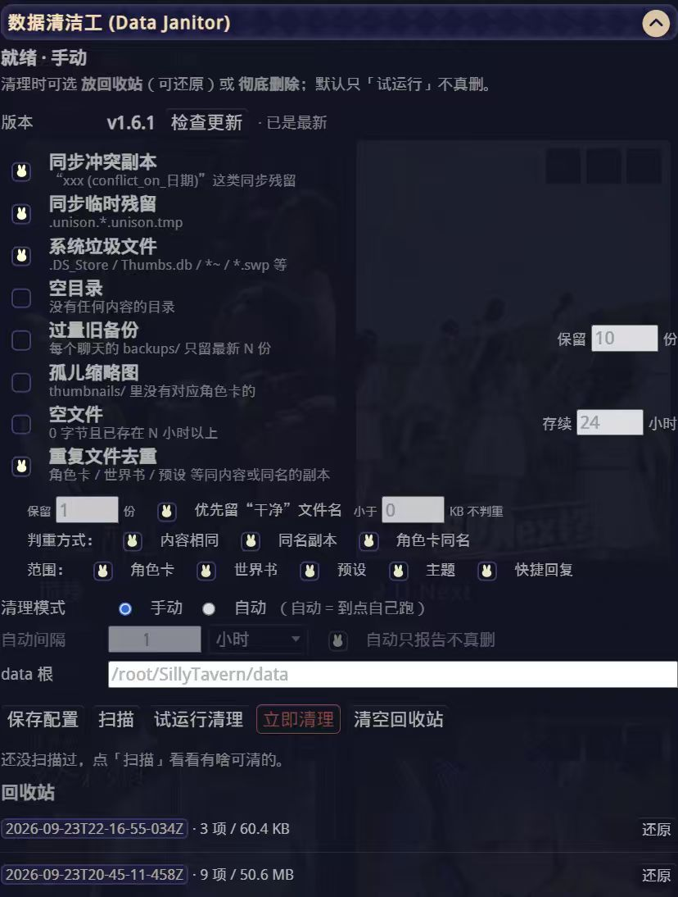

# ST Data Janitor · 数据清洁工

> 给 **SillyTavern** 的「数据保洁员」：自动 / 手动清理 `data` 目录里的**无用数据**与**多余数据**。
> 所有删除**先入回收站**、可一键还原；默认只「试运行」，不点头不动手。

[](LICENSE)
[](https://github.com/SillyTavern/SillyTavern)
[](CHANGELOG.md)
[](#-安装)

---

## ⚠️ 动手之前，请先读完这一节

### 数据无价

你的**角色卡、聊天记录、世界书、预设、主题、人设**……是几个月甚至几年的心血。
它们不像代码可以重写，**删掉就是删掉了**。

本工具确实能帮你清出几个 GB 的空间，但请永远记住：

> **清理 ≠ 备份。任何自动清理工具都不能代替你自己的备份。**

所以，请务必做到：

1. **先备份，再清理。**
   动手前把整个 `data` 目录完整复制一份到**另一块硬盘 / 网盘 / NAS**，或者打包留存：
   ```bash
   # 示例：打包一份带日期的完整备份（放在 data 之外的盘/目录）
   tar czf ~/st-data-backup-$(date +%Y%m%d-%H%M%S).tar.gz -C /path/to/SillyTavern data
   ```
2. **第一次用，只「扫描」和「试运行」。**
   先看看它到底打算删什么、删多少，确认规则符合你的预期。
3. **要开自动清理，先勾「自动只报告不真删」**，观察几天，再放开真删。
4. **定期看一眼回收站**，别让它默默堆着；该清空时再清空。

万一出事，最可靠的恢复手段永远是**你自己的那份备份**。本工具只能帮你「少犯错」，
不能替你「兜底」——这句话，作者是认真的。

---

## ✨ 特性

- 🧹 **8 条清理规则**，每条可独立开关：同步冲突副本 / 同步临时残留 / 系统垃圾文件 / 空目录 / 过量旧备份 / 孤儿缩略图 / 空文件 / **重复文件去重**。
- 🧬 **角色卡 / 世界书 / 预设 去重**：同内容、同名副本、或角色卡「同卡名」的重复都能挑出来；角色卡按**卡内名字**判重（同卡不同文件名也认），并联动清掉对应缩略图。
- 🕹️ **手动 / 自动**：想清就点；也能设「每 N 分钟 / 小时 / 天」自动跑。
- 🧪 **默认试运行**：不开真删就只出报告，先看后删。
- ♻️ **删除进回收站**：同盘 `rename` 秒级完成，带清单文件，可**一键还原**；回收站还能定期自动清空。
- 🗑️ **要不要进回收站、你自己定**：每次清理（含「清理选中项」）都会弹窗问一句——
  「**移入回收站**（可还原）」还是「**彻底删除**（不可恢复）」；选彻底删除会**先自动跑一次试运行**再让你确认，
  服务端也卡了这道关（没试运行过直接发 `permanent` 会被拒）。
- 🧰 **一键安装（分平台）**：`install.sh`（Linux / macOS / NAS / WSL）、`install.ps1` + `install.cmd`（Windows 可双击）、
  `install-docker.sh`（Docker 容器）—— 自动探测酒馆目录、备份旧版本、顺手检查 `enableServerPlugins`。
- 🧩 **前端扩展能在酒馆里直接装**：扩展 → 安装扩展 → URL 填仓库地址，**分支填 `ext-dist`**。
- 🪧 **面板自带安装引导**：服务端插件没装时，面板会直接告诉你，并给一行**可复制的安装命令** + 「重新检测」按钮。
- 🛡️ **硬保护**：`_storage/`（账号库）、`cookie-secret.txt`、`.gitkeep`、`node_modules/`、`.git/` 永不触碰。
- 📦 **旧备份按聊天分组**：保留「每个聊天最新 N 份」，不会因为某个聊天刷得勤就把别的聊天的备份挤光。
- 🔌 **零第三方运行时依赖**：服务端插件只用 Node 内置模块（外加 SillyTavern 自带的 express）。
- 🇨🇳 **中文面板**：设置页里点点点就能用，命令行也能跑。
- 🩺 **面板内检查更新**：面板里显示当前版本 + 「检查更新」按钮；载入时也会静默查一次。
  有新版本会弹窗列出**更新内容**，可一键「立即更新」（或取消）；已是最新则只提示一句。
- 🔍 **扫描后可直接挑文件（预览 + 勾选）**：扫描完列出每个文件，显示 **名字 · 所在目录 · 格式 · 大小**，
  带勾选框；可按规则「全选 / 清空」，也能「全选 / 清空选择」，底部实时显示「已选 N 项 / X」。
  点「清理选中项」就**只清钩上的那些**（照样先进回收站、可还原）。

> 🔎 更新检查是拿「发布分支（`plugin-dist` / `ext-dist`）」上的版本号跟本地比 ——
> 也就是**酒馆 `git pull` 真能拿到的东西**，不是仓库 `main` 上的开发中代码。更新走
> `git fetch + reset --hard`；若目录不是 git 仓库（拷文件装的），会自动改用发布分支的 tar 包覆盖。
> 注意：前端扩展**刷新页面**即生效；服务端插件需**重启酒馆**（面板会提醒）。

---

## 🧩 规则详解

| 规则 | 命中的是什么 | 默认 | 可调参数 |
| --- | --- | --- | --- |
| **同步冲突副本** | 文件名形如 `xxx (conflict_on_2026-09-23)`、`xxx (conflict #1_on_2026-09-23)` 的副本——多设备/云同步打架时留下的 | ✅ 开 | `保留最新 N 份`（0 = 全清，默认 0） |
| **同步临时残留** | `.unison.*.unison.tmp` 之类的同步中间文件 | ✅ 开 | — |
| **系统垃圾文件** | `.DS_Store`、`Thumbs.db`、`desktop.ini`、`*.swp`、`*.orig`、`*~`、`.#*`、`#*#` 等 | ✅ 开 | — |
| **空目录** | 完全没有内容的目录（0 字节，多半是残留空壳） | ⬜ 关 | — |
| **过量旧备份** | `data/<用户>/backups/` 里超量的旧备份，**按聊天分组**只留最新 N 份 | ⬜ 关 | `保留最新 N 份`（默认 10） |
| **孤儿缩略图** | `thumbnails/` 里找不到对应角色卡的图片 | ⬜ 关 | — |
| **空文件** | 0 字节、且已存在超过 N 小时的文件 | ⬜ 关 | `存续 N 小时`（默认 24） |
| **重复文件去重** | 所选集合（角色卡 / 世界书 / 预设 / 主题 / 快捷回复）里「多余副本」：内容完全相同 / 文件名带 `(1)`·`副本`·`copy` 等标记 / 角色卡同卡名 | ⬜ 关 | `保留 N 份`、`优先留干净文件名`、`小于 N KB 不判重`、`判重方式`、`范围` |

> 默认关闭的规则都是**有一定判断风险**或**后果较重**的，请确认后再开。

---

## 🛡️ 安全设计

### 1）删除 = 先问一句，再进回收站（或按你要求彻底删）

点「立即清理 / 清理选中项」时，弹窗会让你选：

- **移入回收站**（推荐）——文件被 `rename` 到下面这个位置，随时可还原：

```
<SillyTavern>/.janitor-trash/<批次时间戳>/files/<原始相对路径>
<SillyTavern>/.janitor-trash/<批次时间戳>/manifest.json
```

- **彻底删除**——直接 `unlink`，**不进回收站、不可恢复**。**要两步**：
  1. 面板会**先强制跑一次试运行**，把「会删什么」按规则列出来（多少项 / 多大）；
  2. 再弹一个确认框（红色按钮）等你点「确认彻底删除」。
  > 服务端也卡了这道关：**没先试运行就直接扔 `permanent: true` 会被拒**（返回 400，提示先试运行）；
  > 试运行结果有效期 15 分钟、且只对同一批目标（同一 `rels` / 同一规则范围）有效。
  没把握就别选这个（至少先点「试运行」看看会动什么）。

回收站模式下：
- `manifest.json` 记录了这一批都动了哪些文件、原本在哪、多大。
- 面板里点「还原」即可把某一批**原样放回**（目标已存在则跳过，不覆盖）。
- 点「清空回收站」才是**永久删除**。
- `trashKeepDays`（默认 7 天）到期的旧批次会在下次清理时自动清空。

### 2）回收站刻意放在 **`data` 的同级目录**

这不是随便定的：如果你在用「酒馆云同步」之类的工具同步整个 `data` 目录，
把回收站放进 `data/` 会让被删的文件**被同步到对面去**（等于白删，甚至「复活」）。
放在同级就天然隔离，双机用户请务必保持这个位置。

### 3）硬保护名单（无论如何都不会动）

- `_storage/` —— 账号数据库，动了会登录异常
- `cookie-secret.txt` —— 各实例的会话密钥
- `.gitkeep`、`node_modules/`、`.git/`、回收站自身

### 4）默认只试运行

`autoCleanDryRun` 默认 `true`：即使开了自动模式，也只生成报告不真删。
等你确认规则合适了，再手动取消这个勾。

---

## 📦 安装

### 前置条件

- SillyTavern **1.12+**（推荐 1.18 / 1.19），且 `config.yaml` 里开了服务端插件：
  ```yaml
  enableServerPlugins: true
  ```
- 说明：本插件由「**服务端插件** + **前端扩展**」两部分组成，缺一不可。

两个落点（后文用 `<ST>` 表示酒馆的**服务端目录**，用户名默认 `default-user`）：

| 装什么 | 放哪里 |
| --- | --- |
| 服务端插件 | `<ST>/plugins/st-data-janitor/`（`index.mjs` + `lib/janitor.mjs`） |
| 前端扩展 | `<ST>/data/<用户名>/extensions/st-data-janitor/`（`manifest.json` + `index.js` + `style.css`） |

> 📌 **先确认你的 `<ST>` 在哪**
>
> - **Standalone 模式**（默认）：`<ST>` 就是 SillyTavern 的安装目录。
> - **Global 模式**（启动脚本带了 `--global`）：配置与数据**不在**安装目录，而在
>   - Windows：`%APPDATA%\SillyTavern\`
>   - macOS：`~/Library/Application Support/SillyTavern/`
>   - Linux：`~/.local/share/SillyTavern/`

### 方式一：一键脚本（最省事，推荐）

脚本会**自己找酒馆目录**（找不到就用 `--st` 指定）、下载最新发布、备份旧版本、顺手检查 `enableServerPlugins`。

**Linux / macOS / NAS（飞牛·群晖·威联通）/ WSL**

```bash
curl -fsSL https://raw.githubusercontent.com/wyndam-c/st-data-janitor/main/install.sh | bash
# 国内下载慢？把链接前面加镜像前缀：
# curl -fsSL https://gh-proxy.com/https://raw.githubusercontent.com/wyndam-c/st-data-janitor/main/install.sh | bash
```

常用的几个参数（完整列表 `--help`）：

```bash
... | bash -s -- --st /root/SillyTavern      # 指定酒馆目录（默认自动探测）
... | bash -s -- --fix-config               # 顺手把 config.yaml 的 enableServerPlugins 打开（会备份）
... | bash -s -- --restart                  # 装完自动重启（认得出 systemd / pm2 / docker 才重启）
... | bash -s -- --dry-run                  # 只演习，不动任何文件
... | bash -s -- --uninstall                # 卸载（移走，不删除）
```

**Windows**：下载 [`install.cmd`](https://raw.githubusercontent.com/wyndam-c/st-data-janitor/main/install.cmd) **双击运行**（它会自己把 `install.ps1` 拉下来），
或者在 PowerShell 里一行：

```powershell
powershell -NoProfile -ExecutionPolicy Bypass -Command "iwr -UseB https://raw.githubusercontent.com/wyndam-c/st-data-janitor/main/install.ps1 -OutFile $env:TEMP\stj-install.ps1; & $env:TEMP\stj-install.ps1"
# 常用参数： -StPath "D:\SillyTavern"   -FixConfig   -Restart   -DryRun   -Uninstall
```

**酒馆跑在 Docker 里**（官方镜像 / linuxserver / NAS 容器套件）：

```bash
curl -fsSL https://raw.githubusercontent.com/wyndam-c/st-data-janitor/main/install-docker.sh | bash
# 或指定容器名 / 容器内路径： bash install-docker.sh sillytavern /home/node/app default-user --dry-run
```

### 方式二：在酒馆里直接装「前端扩展」（酒馆自带的安装界面）

酒馆的**扩展管理**支持填仓库链接装扩展（它接受一个可选的分支名），本项目的扩展文件就在 `ext-dist` 分支根目录，可以直接装：

> **扩展 → 安装扩展** → URL 填 `https://github.com/wyndam-c/st-data-janitor`，**分支填 `ext-dist`** → 安装 → 刷新页面

⚠️ 但酒馆**没有「安装服务端插件」的界面**（`plugins/` 不在任何可安装目录里），所以**服务端那半仍然要用方式一或方式三**。

> 💡 装好前端后会看到面板上的引导卡：它会告诉你「还差服务端插件」，并给出**可一键复制的安装命令**、装完点「重新检测」即可。

### 方式三：手动复制（任何平台通用）

```bash
# 服务端插件
mkdir -p /path/to/SillyTavern/plugins/st-data-janitor/lib
cp plugin/index.mjs        /path/to/SillyTavern/plugins/st-data-janitor/
cp plugin/lib/janitor.mjs  /path/to/SillyTavern/plugins/st-data-janitor/lib/

# 前端扩展
mkdir -p /path/to/SillyTavern/data/default-user/extensions/st-data-janitor
cp extension/* /path/to/SillyTavern/data/default-user/extensions/st-data-janitor/
```

### 方式四：各平台分步教程（想手动掌控细节的看这里）

> 下面所有命令里的路径都请换成你自己的。核心只有三件事：**把两类文件放对地方 → 开 `enableServerPlugins` → 重启酒馆**。

#### 🪟 Windows

酒馆一般安装在 `C:\SillyTavern`（官方建议放在**不受系统监控的目录**，不要放桌面 / 文档）。

1. 装好 [Node.js LTS](https://nodejs.org/) 与 [Git for Windows](https://gitforwindows.org/)（酒馆官方前置）。
2. 开 **PowerShell**，一次性拷进去：

```powershell
$ST = "C:\SillyTavern"                            # ← 改成你的酒馆目录
$EXT = "$ST\data\default-user\extensions\st-data-janitor"

git clone https://github.com/wyndam-c/st-data-janitor.git "$env:TEMP\stj"
New-Item -ItemType Directory -Force "$ST\plugins\st-data-janitor\lib", $EXT | Out-Null
Copy-Item "$env:TEMP\stj\plugin\index.mjs"       "$ST\plugins\st-data-janitor\"
Copy-Item "$env:TEMP\stj\plugin\lib\janitor.mjs" "$ST\plugins\st-data-janitor\lib\"
Copy-Item "$env:TEMP\stj\extension\*"            $EXT
```

3. 用记事本打开 `config.yaml`（在酒馆目录里），确保有这一行（没有就加上）：

```yaml
enableServerPlugins: true
```

4. **双击 `Start.bat`** 重启酒馆。黑窗口里出现 `[st-data-janitor] ready` 即为成功。

> 不想打命令？用资源管理器手建两个文件夹，把 `plugin/index.mjs`、`plugin/lib/janitor.mjs`、`extension/` 里那三个文件分别拖进去即可（效果完全一样）。

#### 🍎 macOS

（酒馆本体安装见官方 [Linux & Mac 向导](https://docs.sillytavern.app/installation/linuxmacos/)）

```bash
ST=~/SillyTavern                                  # ← 改成你的酒馆目录

git clone https://github.com/wyndam-c/st-data-janitor.git /tmp/stj
mkdir -p "$ST/plugins/st-data-janitor/lib" "$ST/data/default-user/extensions/st-data-janitor"
cp /tmp/stj/plugin/index.mjs       "$ST/plugins/st-data-janitor/"
cp /tmp/stj/plugin/lib/janitor.mjs "$ST/plugins/st-data-janitor/lib/"
cp /tmp/stj/extension/*            "$ST/data/default-user/extensions/st-data-janitor/"

nano "$ST/config.yaml"      # 确认 enableServerPlugins: true
cd "$ST" && ./start.sh       # 重启（先 Ctrl+C 停掉旧的）
```

> 或者直接用脚本：`sudo ./install.sh ~/SillyTavern`

#### 🐧 Linux / NAS（群晖 · 飞牛 fnOS · Unraid 等）

与 macOS 命令完全一样，只改 `ST=`：

```bash
ST=/root/SillyTavern      # 群晖常见 /volume1/docker/sillytavern；飞牛常见 /vol1/...
# ……同上那四行 mkdir / cp……
sudo nano "$ST/config.yaml"   # enableServerPlugins: true
cd "$ST" && npm start         # 或你平时用的启动方式（PM2 / systemd / 宝塔 Node 项目）
```

> 🔌 本 README 开头那套「一键更新」（把目录变成 Git 仓库）在 Linux / NAS 上体验最好，推荐搭配使用。

#### 🤖 Android（Termux）

1. 从 [F-Droid](https://f-droid.org/en/packages/com.termux/) 或 [GitHub Releases](https://github.com/termux/termux-app/releases) 装 **Termux**（Play 商店版已停止维护，别用）。
2. 装依赖：

```bash
pkg update && pkg upgrade
pkg install -y git nodejs-lts
```

3. 拷插件（Termux 里的酒馆通常在 `~/SillyTavern`）：

```bash
cd ~/SillyTavern
git clone https://github.com/wyndam-c/st-data-janitor.git ~/stj
mkdir -p ~/SillyTavern/plugins/st-data-janitor/lib \
         ~/SillyTavern/data/default-user/extensions/st-data-janitor
cp ~/stj/plugin/index.mjs       ~/SillyTavern/plugins/st-data-janitor/
cp ~/stj/plugin/lib/janitor.mjs ~/SillyTavern/plugins/st-data-janitor/lib/
cp ~/stj/extension/*            ~/SillyTavern/data/default-user/extensions/st-data-janitor/
nano ~/SillyTavern/config.yaml   # 加一行 enableServerPlugins: true
```

4. 重启：`cd ~/SillyTavern && bash start.sh`（先 Ctrl+C 停掉旧进程）。

手机的坑：

- **Termux 里没有 `sudo`** → 别用 `install.sh`，按上面手拷就行。
- 跑之前先 `termux-wake-lock`，否则屏幕一黑系统就把 Termux 冻死，插件也不会跑。
- 手机存储紧张的话，把回收站保留天数 `trashKeepDays` 调小（默认 7 天），或定期点「清空回收站」。
- 想看文件：用支持 root/Android 目录的文件管理器（如 Material Files）打开 `/data/data/com.termux/files/home/`。

#### 🐳 Docker（含 NAS 里的 Docker）

以官方 compose 的默认映射为例：宿主机 `./plugins` → 容器 `/home/node/app/plugins`，`./data` → 容器 `/home/node/app/data`，`./config` → 容器 `/home/node/app/config`。
**在 compose 文件所在目录**执行：

```bash
git clone https://github.com/wyndam-c/st-data-janitor.git /tmp/stj
mkdir -p ./plugins/st-data-janitor/lib ./data/default-user/extensions/st-data-janitor
cp /tmp/stj/plugin/index.mjs       ./plugins/st-data-janitor/
cp /tmp/stj/plugin/lib/janitor.mjs ./plugins/st-data-janitor/lib/
cp /tmp/stj/extension/*            ./data/default-user/extensions/st-data-janitor/

grep -q 'enableServerPlugins: true' ./config/config.yaml \
  || echo 'enableServerPlugins: true' >> ./config/config.yaml

docker compose restart          # 或：docker restart sillytavern
```

> ⚠️ 你的映射目录名可能不同（如 `SILLYTAVERN_DATA=/volume1/docker/st/data`），按你的 compose 来。
> 看日志：`docker logs -f sillytavern | grep -i janitor`
> 容器内 `data` 也是同步的：如果 `data` 挂在网络盘上，回收站会建在数据目录的**同级**（容器内 `<ST>/.janitor-trash`）。

### 怎么确认装好了？

1. 重启后看酒馆启动日志，应该有这两行：
   - `Initializing plugin from .../st-data-janitor/index.mjs`
   - `[st-data-janitor] ready · dataRoot=... · 手动`
2. 网页里 → 顶部「扩展」→ 找到「**数据清洁工**」。
3. 没装进酒馆也能先验证：`node <ST>/plugins/st-data-janitor/lib/janitor.mjs --scan <ST>/data`

### 最后一步：重启 SillyTavern

服务端插件**只在启动时加载**，装完必须重启一次酒馆，扩展面板里才会出现「数据清洁工」。

---

### 🔄 让酒馆里能「一键更新」（可选）

SillyTavern 启动时的那套「自动更新插件」要求**插件目录自己就是 Git 仓库根**，
而本仓库源码是 `plugin/` + `extension/` 两个子目录，对不上。所以仓库额外维护两条**发布分支**，
把子目录摊平到根：

| 分支 | 根目录内容 | 部署到 |
| --- | --- | --- |
| `main` | 完整源码（plugin/ + extension/ + 文档） | 人看的 |
| `plugin-dist` | `index.mjs`、`lib/` | `plugins/st-data-janitor/` |
| `ext-dist` | `manifest.json`、`index.js`、`style.css` | `data/<用户名>/extensions/st-data-janitor/` |

部署时**别拷文件**，让目标目录直接变成仓库（公开仓库可匿名拉取，不需要密钥/Token）：

```bash
# 服务端插件
cd /path/to/SillyTavern/plugins/st-data-janitor
git init -b main
git remote add origin https://github.com/wyndam-c/st-data-janitor.git
git fetch origin +refs/heads/plugin-dist:refs/remotes/origin/plugin-dist
git checkout -f -B plugin-dist origin/plugin-dist
git branch --set-upstream-to=origin/plugin-dist plugin-dist

# 前端扩展（目录换成 data/<用户名>/extensions/st-data-janitor，分支换成 ext-dist）
```

之后每次酒馆启动，都会自动 `git fetch` + `git pull`
（由 `config.yaml` → `enableServerPluginsAutoUpdate: true` 控制，默认开）。
想手动更新也行，进目录 `git pull` 即可。

> 🏷️ **改版本号请用 `./bump.sh <x.y.z>`**：一条命令同步 4 处（`plugin/index.mjs`、`extension/manifest.json`、
> README 徽章、CHANGELOG 的「未发布」小节），不用再手动找。`./bump.sh --check` 可体检版本号是否一致；
> `./bump.sh <ver> --commit --publish` 顺手提交并生成发布分支；`GITHUB_TOKEN=xxx ./bump.sh v<ver> --release` 建 Release。
>
> ⚠️ **发新版时先跑 `./publish.sh`**（重新生成并推送两条发布分支），否则酒馆拉到的还是旧代码。
>
> 🧷 两条发布分支是**线性历史**（每次发版只是在旧 tip 上追加一个提交），因此酒馆的 `git pull`
> 永远是 fast-forward，不会出现 `Not possible to fast-forward, aborting` 而更新失败。
> （早期版本的 `publish.sh` 用 `git subtree split` + `git push -f`，会改写历史，已弃用。）
>
> 💡 如果你在用云同步工具同步 `data` 目录：请把 **`.git`** 加入同步的排除名单。
> 否则两台机器各自的 Git 元数据会互相打架，生出成堆 ` (conflict_on_…)` 副本。

---

## 🖥️ 使用

### 面板操作（推荐）



重启后打开酒馆 → 右侧「扩展」面板 → 找到 **数据清洁工 (Data Janitor)**：

- **扫描**：只统计，不动手；扫完会在下方列出**逐个文件**（名字 / 目录 / 格式 / 大小）
- **勾选清理**：在扫描结果里勾选要清的文件 → 底部「清理选中项」（或「试运行选中」先预览）
  - 「全选 / 清空选择」对全部；每个规则标题右侧也各有「全选 / 清空」
  - 底部实时显示「已选 N 项 / X MB」；清理完会自动重扫，列表自己刷新
  - 安全：服务端会拿勾选路径跟**本次扫描结果取交集**，不在里面的（比如过期路径）一律跳过
- **试运行清理**：列出「如果清理会动哪些文件」
- **立即清理**：真的清 —— 会弹窗选「**移入回收站**（可还原）」或「**彻底删除**」
  （选彻底删除会**先自动试运行一次**，再让你确认）
- **清空回收站**：彻底删除（不可还原）
- **保存配置**：把规则开关 / 模式 / 间隔写进配置
- **检查更新**：面板顶部显示当前版本；点一下就去比对新版。已是最新→提示「无需更新」；
  有新版本→弹窗列出**更新内容**，可选「立即更新」或「取消」。载入面板时也会自动静默查一次。

> 💡 点上面三个「扫描 / 试运行 / 清理」任意一个，都会弹出一个**全屏居中的进度条弹窗**，
> 实时显示百分比、当前阶段（遍历目录 → 逐条规则 → 去重比对 → 移入回收站）和「已用时间」，
> 不用再盯着面板干等。

### 手动 / 自动

- **手动**（默认）：你想清才清。
- **自动**：选「自动」并设置**间隔**（数值 + 单位：分钟 / 小时 / 天），到点自动跑。
  - 建议同时勾上「**自动只报告不真删**」，先观察，再放开。
  - 每次自动运行的结果会显示在面板状态栏与「最近报告」里。

### 命令行（不装到酒馆也能跑）

核心逻辑是独立的，可以直接命令行调用，适合写进 crontab 或临时救急：

```bash
# 只看不动（默认规则：冲突副本 + 同步临时残留 + 系统垃圾）
node plugin/lib/janitor.mjs --scan  /path/to/SillyTavern/data

# 试运行：列出会动的东西
node plugin/lib/janitor.mjs --clean /path/to/SillyTavern/data

# 真清理（移入回收站）
node plugin/lib/janitor.mjs --clean /path/to/SillyTavern/data --apply

# 附加规则示例：旧备份 + 空目录（每个聊天保留最新 30 份）
node plugin/lib/janitor.mjs --scan  /path/to/SillyTavern/data --old-backups --keep 30 --empty-dirs

# 去重（角色卡/世界书/预设…），每组保留 1 份
node plugin/lib/janitor.mjs --scan  /path/to/SillyTavern/data --dupes --dup-keep 1
```

输出为 JSON，方便二次处理。

### HTTP API

（挂载在 `/api/plugins/st-data-janitor` 下，随酒馆的鉴权走）

| 方法 | 路径 | 说明 |
| --- | --- | --- |
| GET | `/status` | 状态 + 配置 + 最近一次报告 + 回收站列表 |
| GET | `/config` | 读取配置 |
| POST | `/config` | 保存配置 |
| POST | `/scan` | 开始扫描（后台跑，结果进 `/status`；`rules[id].items` 里含 `name/dir/type/size`） |
| POST | `/scan/stream` | 扫描并**流式**回报进度（NDJSON，前端进度条用） |
| POST | `/clean` | 开始清理，body：`{ rules?: string[], rels?: string[], dryRun?: boolean, permanent?: boolean }` |
| POST | `/clean/stream` | 清理并流式回报进度（同上）。带 `rels` = **只清选中的那些**（返回里有 `notFoundCount`）；`permanent: true` = **彻底删除**（必须先跑过一次 `dryRun: true`，否则 400） |
| GET | `/trash` | 回收站批次列表 |
| POST | `/restore` | 还原某一批，body：`{ batch }` |
| POST | `/empty-trash` | 清空回收站，body：`{ keepDays? }` |
| GET | `/update-check` | 检查是否有新版本（返回 `current` / `latest` / `hasUpdate` / `notes`） |
| POST | `/update-apply` | 一键更新（拉取 `plugin-dist` / `ext-dist` 发布分支） |

---

## ⚙️ 配置项

配置文件为运行时生成的 `plugins/st-data-janitor/config.json`（不在仓库里）：

```jsonc
{
  "enabled": true,
  "dataRoot": "/path/to/SillyTavern/data",  // 留空自动探测 <ST>/data
  "mode": "manual",                         // manual | auto
  "intervalValue": 1,                       // 自动间隔数值
  "intervalUnit": "hours",                  // minutes | hours | days
  "autoCleanDryRun": true,                  // 自动模式只报告不真删
  "trashKeepDays": 7,                       // 回收站保留天数，超期自动清空
  "rules": {
    "conflictCopies": { "enabled": true,  "keepNewest": 0 },
    "unisonTemp":     { "enabled": true },
    "junkFiles":      { "enabled": true },
    "emptyDirs":      { "enabled": false },
    "oldBackups":     { "enabled": false, "keepNewest": 10 },
    "orphanThumbs":   { "enabled": false },
    "zeroByteFiles":  { "enabled": false, "minAgeHours": 24 },
    "duplicates": {                        // 重复文件去重（默认关闭）
      "enabled": false,
      "keepNewest": 1,                     // 每组保留 N 份
      "preferBase": true,                  // 优先留文件名“干净”的那份，再按时间取最新
      "minSizeKB": 0,                      // 小于该体积不判重（0=不限；可避开空模板误伤）
      "identical": true,                   // 判重方式①：内容相同
      "nameCopies": true,                  // 判重方式②：同名副本（(1)/副本/copy…）
      "charNames": true,                   // 判重方式③：角色卡按卡名判重
      "scope": ["characters", "worlds", "presets", "themes", "quickreplies"]
    }
  }
}
```

---

## 🧠 工作原理


```
扫描(scan)                          清理(clean)
──────────                          ──────────
遍历 data/                          按启用的规则挑出目标
  ├─ 跳过 node_modules/.git/回收站    ├─ 文件 → rename 进 <ST>/.janitor-trash/<批次>/files/
  ├─ 逐条规则匹配文件名/路径          ├─ 空目录 → 直接 rmdir
  └─ 汇总为 每规则{数量,体积,样本}    └─ 写 manifest.json（可还原）
                                     └─ 顺带清理过期回收站批次
```

- 「过期」判定基于**文件修改时间**（`mtime`），不是创建时间。
- 旧备份分组规则：把备份文件名尾部的 `_YYYYMMDD-HHMMSS` 时间戳去掉当分组键，
  同组内按 `mtime` 倒序保留最新 N 份。
- 同步冲突副本的「保留最新 N 份」同理：去掉冲突标记后同名的算一组。

---

## ❓ 常见问题

**Q：会不会把我正在用的聊天/角色卡删了？**
A：默认规则只匹配「冲突副本 / 同步临时文件 / 系统垃圾」这类明确的残留物，不碰正常数据文件。
其余规则默认**关闭**，需要你手动开启。而且所有删除都先进回收站、可还原。

**Q：回收站清空了才能释放磁盘吗？**
A：是的。回收站和 `data` 在同一个文件系统上，**移动不释放空间**；只有「清空回收站」才真正腾出磁盘。
（这也是刻意设计：给你留一条后悔路。）

**Q：为什么我 `backups/` 一直涨？**
A：多半是 **SillyTavern 自带的聊天备份**（`config.yaml` → `backups.chat.enabled: true`）。
它每次保存聊天都会存一份快照，`backups.chat.maxTotalBackups: -1` 表示**不限总量**，于是可以无限增长。
想封顶就把它改成具体数字（比如 `200` 或 `300`），或直接 `enabled: false` 关掉——**但请先想清楚：那等于放弃回滚能力**。
本插件的「过量旧备份」规则只是打扫战场，不是治本；并且**默认关闭**。

**Q：我用了云同步（如 st-cloud-sync / Unison）会有影响吗？**
A：两条注意：① 回收站必须在 `data` 同级（本插件已如此），否则会被同步带走；
② 你在 A 机清理的文件，下一轮同步会同步删除到 B 机——这是预期行为，但请确认你确实想两边都删。

**Q：去重会不会把我不同版本的角色卡 / 预设删了？**
A：「内容相同」只删**字节完全一致**的；「同名副本」只删文件名带 `(1)` / `副本` / `copy` 等明确标记的；「角色卡同名」按**卡内名字**判重——同名的两张卡只留一张（默认留文件名最干净的，再按时间取最新）。
如果你收藏了同一角色的多个不同版本（名字一样、内容不同），请**关掉「角色卡同名」**，或先给要保的版本改名。
世界书/预设以**文件名**为身份，只做「内容相同」判重；若你有一堆内容相同但各自独立的空世界书（如自动生成的「XX总结」），把「小于 N KB 不判重」调大即可避开。误删都进回收站，可整批还原。

**Q：支持 Docker / Windows / macOS 吗？**
A：核心逻辑是纯 Node 文件操作，理论上都能跑；差别只在路径与启动脚本。
Docker 用户把 `dataRoot` 指到容器内挂载的 `data` 路径即可。

**Q：「空目录」删了会不会影响酒馆？**
A：SillyTavern 需要时会自己重建这些目录，一般是安全的。
但如果你介意，保持它**关闭**即可——它也不省任何空间（0 字节）。

---

## 📁 目录结构

```
st-data-janitor/
├── plugin/
│   ├── index.mjs            # 服务端插件（HTTP API、定时器、配置）
│   └── lib/
│       └── janitor.mjs      # 核心逻辑（可独立命令行运行）
├── extension/
│   ├── manifest.json        # 扩展声明
│   ├── index.js             # 面板 UI
│   └── style.css
├── assets/
│   ├── banner.png           # 头图
│   ├── flow.png             # 工作流程图
│   └── screenshot-panel.jpg # 扩展面板实拍截图
├── install.sh               # 一键安装：Linux / macOS / NAS / WSL
├── install.ps1              # 一键安装：Windows（PowerShell）
├── install.cmd              # Windows 双击入口（会自动拿 install.ps1）
├── install-docker.sh        # 酒馆跑在 Docker 容器里时用
├── publish.sh               # 生成/推送 plugin-dist、ext-dist 发布分支
├── bump.sh                  # 版本号一次性同步（4 处）+ 体检/提交/发布
├── README.md
├── CHANGELOG.md
└── LICENSE                  # MIT
```

---

## 🙏 致谢 & 免责

- 感谢 [SillyTavern](https://github.com/SillyTavern/SillyTavern) 提供可扩展的服务端插件与扩展体系。
- 本工具会**修改你的文件**。作者已尽力把默认行为做到保守（试运行 + 回收站 + 硬保护），
  但**不构成任何形式的担保**：因使用本工具造成的数据丢失、服务异常等后果，
  由使用者自行承担。**用前请备份，数据无价。**

---

## 📄 开源协议

本项目基于 [MIT License](LICENSE) 开源，Copyright © 2026 白鸦（[@wyndam-c](https://github.com/wyndam-c)）。

你可以自由使用、修改、分发（包括商用），只需保留版权声明与许可声明。

---

有问题欢迎提 [Issue](https://github.com/wyndam-c/st-data-janitor/issues) 或 PR。
